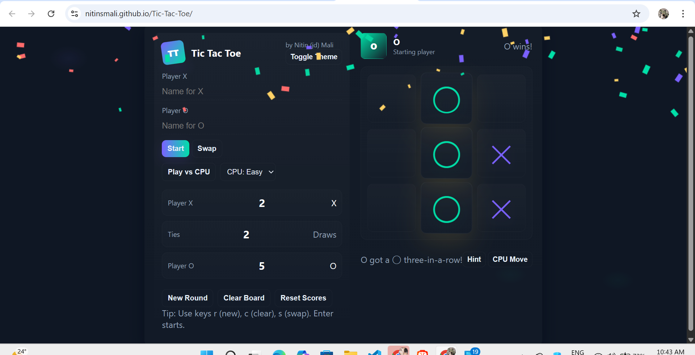

# 🎮Tic-Tac-Toe Game
An interactive and feature-rich **Tic-Tac-Toe game** built using **HTML, CSS, and JavaScript**.  
Play against a friend or challenge the CPU with different difficulty levels.

🔗 **Live Demo:**  
👉 https://nitinsmali.github.io/Tic-Tac-Toe/

---

### 🏠 Main Game Interface

---

## 🚀 Features

### 🎮 Gameplay Modes
- 👥 Player vs Player
- 🤖 Player vs CPU
- 🎯 Selectable CPU difficulty (Easy mode available)
- 🔄 Swap starting player
- 🆕 Start new round anytime
---

### 🧠 Smart Game Logic
- ✅ Automatic win detection
- 🤝 Draw detection
- 🏆 Winner announcement display
- 🟢 Highlights three-in-a-row
- 💡 Hint button for move suggestion
- 🤖 CPU Move button
---

### 📊 Scoreboard System
- 📈 Live score tracking
- ❌ Player X score
- ⭕ Player O score
- 🤝 Total draws (ties)
- 🔄 Reset Scores button
- 🧹 Clear Board option
---

### 🎨 UI & Experience
- 🌙 Toggle Theme (Dark / Light mode)
- ✨ Modern glowing UI design
- 📱 Fully responsive layout
- 🎯 Clean and user-friendly interface
- 🧩 Smooth game interactions
---

### ⌨️ Keyboard Shortcuts

| Key | Action |
|-----|--------|
| `r` | New Round |
| `c` | Clear Board |
| `s` | Swap Player |
| `Enter` | Start Game |
---

## 🎮 How to Play

1. Enter Player X and Player O names.
2. Choose gameplay mode (vs Player or vs CPU).
3. Select CPU difficulty (if playing vs CPU).
4. Click **Start** to begin.
5. Players take turns placing X and O.
6. First to get **3 in a row** (horizontal, vertical, or diagonal) wins.
7. Use control buttons to manage the game.
---

## 🛠️ Technologies Used
- HTML5  
- CSS3  
- JavaScript (Vanilla JS)
---

## 💡 Future Improvements

- 🔊 Add sound effects  
- 🧠 Add Medium & Hard AI difficulty  
- 🌐 Online multiplayer mode  
- 📊 Game statistics tracking  
- 🏅 Match history feature  
---
## 👨‍💻 Author

## ***Nitin Mali(JD)***
GitHub:  
https://github.com/nitinsmali
